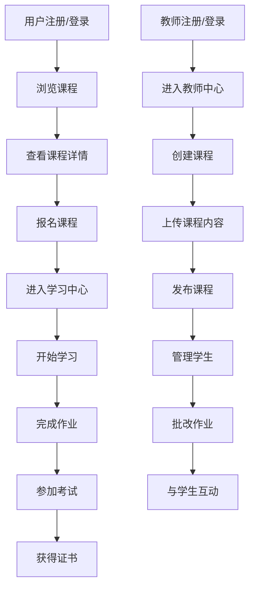

## 1. Product Overview
在线课程系统是一个基于现代技术栈的全栈学习平台，为用户提供优质的在线教育体验。
- 主要解决用户随时随地学习、管理学习进度、获取高质量教育资源的问题，目标用户包括学生、教师和教育机构。
- 产品价值在于打破时间和空间限制，提供个性化学习体验，降低教育成本，提高学习效率。

## 2. Core Features

### 2.1 User Roles
| Role | Registration Method | Core Permissions |
|------|---------------------|------------------|
| 学生 | 邮箱/手机号注册 | 浏览课程、报名课程、观看课程、提交作业、参与讨论 |
| 教师 | 邀请码注册 | 发布课程、管理课程内容、批改作业、发起讨论、查看学生进度 |
| 管理员 | 系统分配 | 管理用户、管理课程分类、系统配置、数据统计 |

### 2.2 Feature Module
1. **首页**: 课程推荐、热门课程、分类导航、搜索功能
2. **课程详情页**: 课程介绍、讲师信息、课程大纲、评论区
3. **学习中心**: 我的课程、学习进度、作业管理、证书管理
4. **教师中心**: 课程管理、学生管理、数据分析
5. **管理后台**: 用户管理、课程管理、系统配置

### 2.3 Page Details
| Page Name | Module Name | Feature description |
|-----------|-------------|---------------------|
| 首页 | 课程推荐 | 根据用户兴趣和历史行为推荐相关课程，支持个性化推荐算法 |
| 首页 | 热门课程 | 展示当前最受欢迎的课程，按点击率和报名人数排序 |
| 首页 | 分类导航 | 提供课程分类筛选，包括学科、难度、类型等维度 |
| 首页 | 搜索功能 | 支持关键词搜索课程、讲师和学习资料 |
| 课程详情页 | 课程介绍 | 展示课程详细信息，包括课程目标、适合人群、学习收益等 |
| 课程详情页 | 讲师信息 | 展示讲师简介、教学经验、专业背景等 |
| 课程详情页 | 课程大纲 | 展示课程章节结构、每节课内容简介和时长 |
| 课程详情页 | 评论区 | 允许已报名学生发表评论和评分，支持回复功能 |
| 学习中心 | 我的课程 | 展示已报名和收藏的课程，按学习进度排序 |
| 学习中心 | 学习进度 | 记录每门课程的学习进度，包括已完成章节、观看时长等 |
| 学习中心 | 作业管理 | 查看和提交课程作业，查看作业批改结果和反馈 |
| 学习中心 | 证书管理 | 展示已获得的课程证书，支持下载和分享功能 |
| 教师中心 | 课程管理 | 创建和编辑课程，上传课程视频和资料，设置课程价格和报名条件 |
| 教师中心 | 学生管理 | 查看课程报名学生列表，管理学生权限，发送通知 |
| 教师中心 | 数据分析 | 查看课程统计数据，包括报名人数、完成率、评分等 |
| 管理后台 | 用户管理 | 管理所有用户账号，包括创建、编辑、禁用等操作 |
| 管理后台 | 课程管理 | 审核和管理所有课程，包括推荐、下架等操作 |
| 管理后台 | 系统配置 | 设置系统参数、支付方式、邮件模板等 |

## 3. Core Process
用户学习流程：用户注册/登录 → 浏览课程 → 选择感兴趣的课程 → 查看课程详情 → 报名课程 → 进入学习中心 → 开始学习 → 完成作业 → 参加考试 → 获得证书

教师授课流程：教师注册/登录 → 进入教师中心 → 创建课程 → 上传课程内容 → 发布课程 → 管理学生 → 批改作业 → 与学生互动

## 4. User Interface Design
### 4.1 Design Style
- 主色调：#4F46E5（紫色）、#10B981（绿色）
- 辅助色：#F59E0B（橙色）、#EF4444（红色）
- 按钮样式：圆角按钮，hover效果为轻微放大和阴影变化
- 字体：主标题使用 Inter 字体，正文使用系统默认字体
- 字体大小：标题 24-32px，副标题 18-24px，正文 14-16px
- 布局风格：卡片式布局，清晰的信息层次，适当的留白
- 图标风格：线性图标，简洁现代，与整体设计风格统一

### 4.2 Page Design Overview
| Page Name | Module Name | UI Elements |
|-----------|-------------|-------------|
| 首页 | 课程推荐 | 卡片式布局，每张卡片包含课程封面、标题、讲师、价格和评分，hover效果为卡片轻微上浮 |
| 首页 | 热门课程 | 横向滚动卡片，包含课程封面、标题、报名人数和评分，使用渐变色背景突出显示 |
| 首页 | 分类导航 | 网格布局的分类图标，每个分类包含图标和名称，点击后跳转到对应分类页面 |
| 课程详情页 | 课程介绍 | 顶部大图展示课程封面，下方为课程标题、评分、价格和报名按钮，使用卡片式布局展示课程详情 |
| 课程详情页 | 课程大纲 | 可折叠的章节列表，每个章节显示课时数和总时长，点击展开查看具体内容 |
| 学习中心 | 我的课程 | 列表式布局，每门课程显示封面、标题、学习进度条和最近学习时间，支持排序和筛选 |
| 教师中心 | 课程管理 | 表格布局，显示课程名称、状态、报名人数、创建时间等信息，支持编辑和删除操作 |

### 4.3 Responsiveness
- 设计采用桌面优先原则，同时支持移动端适配
- 断点设置：桌面端（≥1200px）、平板端（768px-1199px）、移动端（<768px）
- 移动端优化：简化导航为汉堡菜单，调整卡片布局为单列，优化触摸交互

### 4.4 3D Scene Guidance
- 不适用，本项目为教育平台，无需3D场景