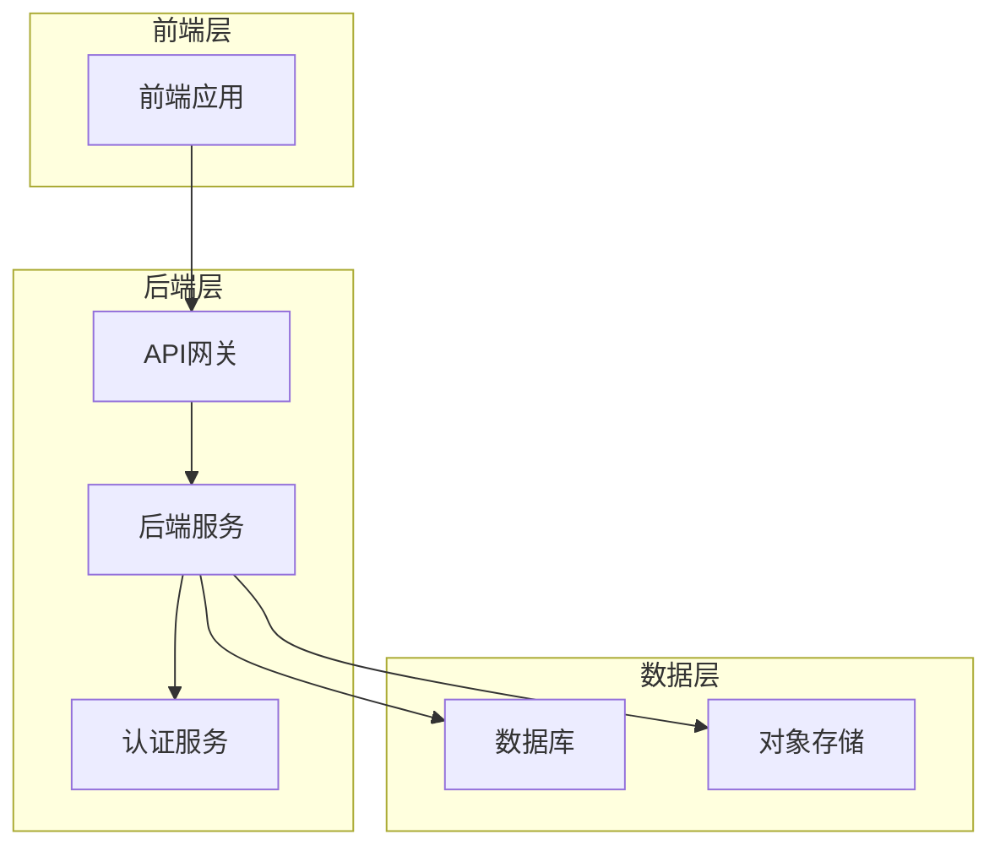
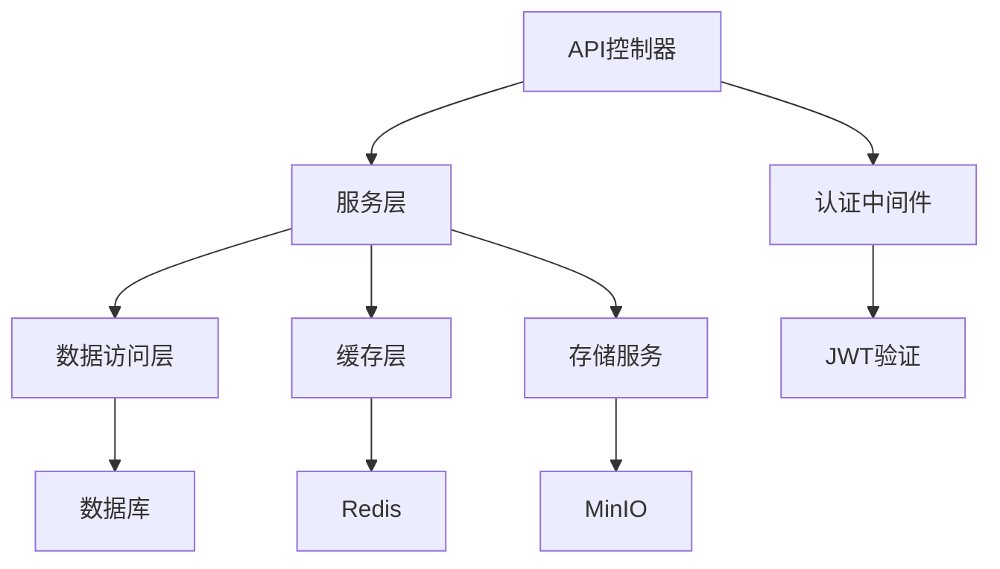
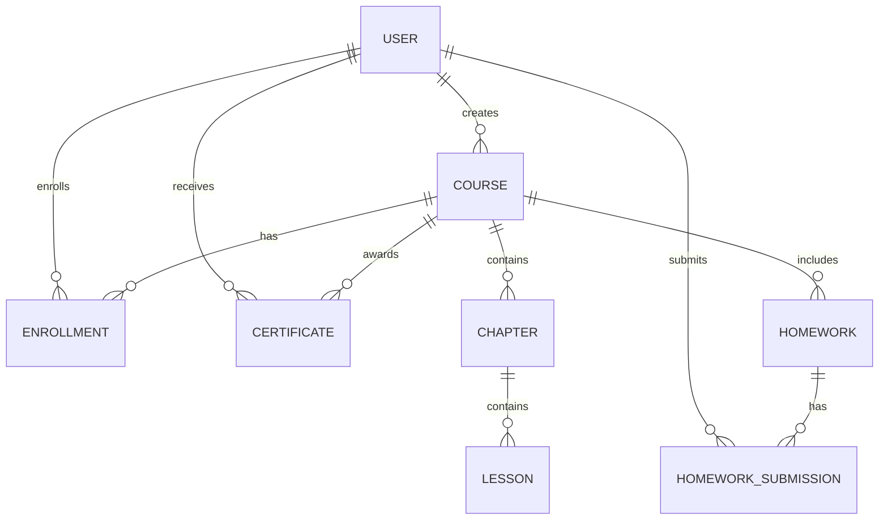

## 1. Architecture Design


## 2. Technology Description
- 前端：Vue 3.5.7 + Composition API + Vite 6.2.3 + Element Plus 2.10.2 + UnoCSS 66.4.2
- 后端：Go 1.23 + Gin 1.10.0 + GORM 1.25.12
- 数据库：MySQL 8.0
- 认证：JWT 5.2.2
- 存储：MinIO（用于存储课程视频和资料）
- 缓存：Redis 9.7.0
- 文档：Swagger

## 3. Route Definitions

### 前端路由
| Route | Purpose |
|-------|---------|
| / | 首页 |
| /course/:id | 课程详情页 |
| /learning | 学习中心 |
| /learning/course/:id | 课程学习页 |
| /learning/homework | 作业管理 |
| /learning/certificate | 证书管理 |
| /teacher | 教师中心 |
| /teacher/course | 课程管理 |
| /teacher/student | 学生管理 |
| /teacher/analytics | 数据分析 |
| /admin | 管理后台 |
| /admin/user | 用户管理 |
| /admin/course | 课程管理 |
| /admin/config | 系统配置 |
| /login | 登录页 |
| /register | 注册页 |

### 后端API路由
| Route | Method | Purpose |
|-------|--------|---------|
| /api/v1/auth/login | POST | 用户登录 |
| /api/v1/auth/register | POST | 用户注册 |
| /api/v1/auth/refresh | POST | 刷新Token |
| /api/v1/course | GET | 获取课程列表 |
| /api/v1/course/:id | GET | 获取课程详情 |
| /api/v1/course | POST | 创建课程（教师） |
| /api/v1/course/:id | PUT | 更新课程（教师） |
| /api/v1/course/:id | DELETE | 删除课程（教师） |
| /api/v1/course/:id/enroll | POST | 报名课程 |
| /api/v1/learning/courses | GET | 获取我的课程 |
| /api/v1/learning/progress | GET | 获取学习进度 |
| /api/v1/learning/progress | PUT | 更新学习进度 |
| /api/v1/homework | GET | 获取作业列表 |
| /api/v1/homework/:id | GET | 获取作业详情 |
| /api/v1/homework/:id/submit | POST | 提交作业 |
| /api/v1/homework/:id/grade | PUT | 批改作业（教师） |
| /api/v1/certificate | GET | 获取证书列表 |
| /api/v1/certificate/:id | GET | 获取证书详情 |
| /api/v1/teacher/courses | GET | 获取教师课程列表 |
| /api/v1/teacher/students | GET | 获取课程学生列表 |
| /api/v1/teacher/analytics | GET | 获取课程数据分析 |
| /api/v1/admin/users | GET | 获取用户列表 |
| /api/v1/admin/users/:id | PUT | 更新用户信息 |
| /api/v1/admin/courses | GET | 获取所有课程列表 |
| /api/v1/admin/courses/:id/status | PUT | 更新课程状态 |

## 4. API Definitions

### 认证相关API

#### 登录请求
```typescript
interface LoginRequest {
  username: string;      // 用户名/邮箱/手机号
  password: string;      // 密码
  role: string;          // 用户角色：student/teacher/admin
}
```

#### 登录响应
```typescript
interface LoginResponse {
  code: number;          // 状态码
  data: {
    token: string;       // JWT token
    user: {
      id: number;        // 用户ID
      username: string;  // 用户名
      role: string;      // 用户角色
      avatar?: string;   // 头像
    }
  };
  msg: string;           // 消息
}
```

### 课程相关API

#### 课程列表请求
```typescript
interface CourseListRequest {
  page: number;          // 页码
  pageSize: number;      // 每页数量
  category?: string;     // 分类
  level?: string;        // 难度
  keyword?: string;      // 关键词
}
```

#### 课程列表响应
```typescript
interface CourseListResponse {
  code: number;          // 状态码
  data: {
    list: Course[];      // 课程列表
    total: number;       // 总数量
  };
  msg: string;           // 消息
}

interface Course {
  id: number;            // 课程ID
  title: string;         // 课程标题
  description: string;   // 课程描述
  cover: string;         // 封面图片
  price: number;         // 价格
  originalPrice: number; // 原价
  level: string;         // 难度级别
  category: string;      // 分类
  teacherId: number;     // 教师ID
  teacherName: string;   // 教师姓名
  studentCount: number;  // 学生人数
  rating: number;        // 评分
  createdAt: string;     // 创建时间
}
```

## 5. Server Architecture Diagram


## 6. Data Model

### 6.1 Data Model Definition


### 6.2 Data Definition Language

#### 用户表 (users)
```sql
CREATE TABLE `users` (
  `id` bigint(20) unsigned NOT NULL AUTO_INCREMENT,
  `username` varchar(50) NOT NULL COMMENT '用户名',
  `email` varchar(100) NOT NULL COMMENT '邮箱',
  `phone` varchar(20) DEFAULT NULL COMMENT '手机号',
  `password` varchar(100) NOT NULL COMMENT '密码',
  `role` enum('student','teacher','admin') NOT NULL DEFAULT 'student' COMMENT '角色',
  `avatar` varchar(255) DEFAULT NULL COMMENT '头像',
  `bio` text DEFAULT NULL COMMENT '个人简介',
  `created_at` datetime NOT NULL DEFAULT CURRENT_TIMESTAMP,
  `updated_at` datetime NOT NULL DEFAULT CURRENT_TIMESTAMP ON UPDATE CURRENT_TIMESTAMP,
  PRIMARY KEY (`id`),
  UNIQUE KEY `uk_username` (`username`),
  UNIQUE KEY `uk_email` (`email`)
) ENGINE=InnoDB DEFAULT CHARSET=utf8mb4 COMMENT='用户表';
```

#### 课程表 (courses)
```sql
CREATE TABLE `courses` (
  `id` bigint(20) unsigned NOT NULL AUTO_INCREMENT,
  `title` varchar(100) NOT NULL COMMENT '课程标题',
  `description` text NOT NULL COMMENT '课程描述',
  `cover` varchar(255) NOT NULL COMMENT '封面图片',
  `price` decimal(10,2) NOT NULL DEFAULT 0.00 COMMENT '价格',
  `original_price` decimal(10,2) NOT NULL DEFAULT 0.00 COMMENT '原价',
  `level` enum('beginner','intermediate','advanced') NOT NULL DEFAULT 'beginner' COMMENT '难度级别',
  `category` varchar(50) NOT NULL COMMENT '分类',
  `teacher_id` bigint(20) unsigned NOT NULL COMMENT '教师ID',
  `status` enum('draft','published','archived') NOT NULL DEFAULT 'draft' COMMENT '状态',
  `student_count` int(11) NOT NULL DEFAULT 0 COMMENT '学生人数',
  `rating` decimal(3,2) NOT NULL DEFAULT 0.00 COMMENT '评分',
  `created_at` datetime NOT NULL DEFAULT CURRENT_TIMESTAMP,
  `updated_at` datetime NOT NULL DEFAULT CURRENT_TIMESTAMP ON UPDATE CURRENT_TIMESTAMP,
  PRIMARY KEY (`id`),
  KEY `idx_teacher_id` (`teacher_id`),
  KEY `idx_category` (`category`),
  KEY `idx_status` (`status`)
) ENGINE=InnoDB DEFAULT CHARSET=utf8mb4 COMMENT='课程表';
```

#### 章节表 (chapters)
```sql
CREATE TABLE `chapters` (
  `id` bigint(20) unsigned NOT NULL AUTO_INCREMENT,
  `course_id` bigint(20) unsigned NOT NULL COMMENT '课程ID',
  `title` varchar(100) NOT NULL COMMENT '章节标题',
  `order` int(11) NOT NULL DEFAULT 0 COMMENT '排序',
  `created_at` datetime NOT NULL DEFAULT CURRENT_TIMESTAMP,
  `updated_at` datetime NOT NULL DEFAULT CURRENT_TIMESTAMP ON UPDATE CURRENT_TIMESTAMP,
  PRIMARY KEY (`id`),
  KEY `idx_course_id` (`course_id`)
) ENGINE=InnoDB DEFAULT CHARSET=utf8mb4 COMMENT='章节表';
```

#### 课时表 (lessons)
```sql
CREATE TABLE `lessons` (
  `id` bigint(20) unsigned NOT NULL AUTO_INCREMENT,
  `chapter_id` bigint(20) unsigned NOT NULL COMMENT '章节ID',
  `title` varchar(100) NOT NULL COMMENT '课时标题',
  `video_url` varchar(255) NOT NULL COMMENT '视频地址',
  `duration` int(11) NOT NULL DEFAULT 0 COMMENT '时长（秒）',
  `content` text DEFAULT NULL COMMENT '内容',
  `order` int(11) NOT NULL DEFAULT 0 COMMENT '排序',
  `created_at` datetime NOT NULL DEFAULT CURRENT_TIMESTAMP,
  `updated_at` datetime NOT NULL DEFAULT CURRENT_TIMESTAMP ON UPDATE CURRENT_TIMESTAMP,
  PRIMARY KEY (`id`),
  KEY `idx_chapter_id` (`chapter_id`)
) ENGINE=InnoDB DEFAULT CHARSET=utf8mb4 COMMENT='课时表';
```

#### 报名记录表 (enrollments)
```sql
CREATE TABLE `enrollments` (
  `id` bigint(20) unsigned NOT NULL AUTO_INCREMENT,
  `user_id` bigint(20) unsigned NOT NULL COMMENT '用户ID',
  `course_id` bigint(20) unsigned NOT NULL COMMENT '课程ID',
  `status` enum('active','completed') NOT NULL DEFAULT 'active' COMMENT '状态',
  `created_at` datetime NOT NULL DEFAULT CURRENT_TIMESTAMP,
  `updated_at` datetime NOT NULL DEFAULT CURRENT_TIMESTAMP ON UPDATE CURRENT_TIMESTAMP,
  PRIMARY KEY (`id`),
  UNIQUE KEY `uk_user_course` (`user_id`,`course_id`),
  KEY `idx_course_id` (`course_id`)
) ENGINE=InnoDB DEFAULT CHARSET=utf8mb4 COMMENT='报名记录表';
```

#### 学习进度表 (learning_progress)
```sql
CREATE TABLE `learning_progress` (
  `id` bigint(20) unsigned NOT NULL AUTO_INCREMENT,
  `user_id` bigint(20) unsigned NOT NULL COMMENT '用户ID',
  `course_id` bigint(20) unsigned NOT NULL COMMENT '课程ID',
  `lesson_id` bigint(20) unsigned NOT NULL COMMENT '课时ID',
  `watched_duration` int(11) NOT NULL DEFAULT 0 COMMENT '已观看时长（秒）',
  `is_completed` tinyint(1) NOT NULL DEFAULT 0 COMMENT '是否完成',
  `updated_at` datetime NOT NULL DEFAULT CURRENT_TIMESTAMP ON UPDATE CURRENT_TIMESTAMP,
  PRIMARY KEY (`id`),
  UNIQUE KEY `uk_user_lesson` (`user_id`,`lesson_id`),
  KEY `idx_course_id` (`course_id`)
) ENGINE=InnoDB DEFAULT CHARSET=utf8mb4 COMMENT='学习进度表';
```

#### 作业表 (homeworks)
```sql
CREATE TABLE `homeworks` (
  `id` bigint(20) unsigned NOT NULL AUTO_INCREMENT,
  `course_id` bigint(20) unsigned NOT NULL COMMENT '课程ID',
  `title` varchar(100) NOT NULL COMMENT '作业标题',
  `description` text NOT NULL COMMENT '作业描述',
  `deadline` datetime DEFAULT NULL COMMENT '截止时间',
  `created_at` datetime NOT NULL DEFAULT CURRENT_TIMESTAMP,
  `updated_at` datetime NOT NULL DEFAULT CURRENT_TIMESTAMP ON UPDATE CURRENT_TIMESTAMP,
  PRIMARY KEY (`id`),
  KEY `idx_course_id` (`course_id`)
) ENGINE=InnoDB DEFAULT CHARSET=utf8mb4 COMMENT='作业表';
```

#### 作业提交表 (homework_submissions)
```sql
CREATE TABLE `homework_submissions` (
  `id` bigint(20) unsigned NOT NULL AUTO_INCREMENT,
  `homework_id` bigint(20) unsigned NOT NULL COMMENT '作业ID',
  `user_id` bigint(20) unsigned NOT NULL COMMENT '用户ID',
  `content` text NOT NULL COMMENT '提交内容',
  `file_url` varchar(255) DEFAULT NULL COMMENT '提交文件',
  `grade` decimal(5,2) DEFAULT NULL COMMENT '评分',
  `feedback` text DEFAULT NULL COMMENT '反馈',
  `status` enum('submitted','graded') NOT NULL DEFAULT 'submitted' COMMENT '状态',
  `submitted_at` datetime NOT NULL DEFAULT CURRENT_TIMESTAMP,
  `graded_at` datetime DEFAULT NULL,
  PRIMARY KEY (`id`),
  UNIQUE KEY `uk_homework_user` (`homework_id`,`user_id`),
  KEY `idx_user_id` (`user_id`)
) ENGINE=InnoDB DEFAULT CHARSET=utf8mb4 COMMENT='作业提交表';
```

#### 证书表 (certificates)
```sql
CREATE TABLE `certificates` (
  `id` bigint(20) unsigned NOT NULL AUTO_INCREMENT,
  `user_id` bigint(20) unsigned NOT NULL COMMENT '用户ID',
  `course_id` bigint(20) unsigned NOT NULL COMMENT '课程ID',
  `certificate_url` varchar(255) NOT NULL COMMENT '证书地址',
  `issued_at` datetime NOT NULL DEFAULT CURRENT_TIMESTAMP COMMENT '颁发时间',
  PRIMARY KEY (`id`),
  UNIQUE KEY `uk_user_course` (`user_id`,`course_id`),
  KEY `idx_user_id` (`user_id`),
  KEY `idx_course_id` (`course_id`)
) ENGINE=InnoDB DEFAULT CHARSET=utf8mb4 COMMENT='证书表';
```

#### 评论表 (comments)
```sql
CREATE TABLE `comments` (
  `id` bigint(20) unsigned NOT NULL AUTO_INCREMENT,
  `course_id` bigint(20) unsigned NOT NULL COMMENT '课程ID',
  `user_id` bigint(20) unsigned NOT NULL COMMENT '用户ID',
  `content` text NOT NULL COMMENT '评论内容',
  `rating` int(11) NOT NULL DEFAULT 5 COMMENT '评分（1-5）',
  `parent_id` bigint(20) unsigned DEFAULT NULL COMMENT '父评论ID',
  `created_at` datetime NOT NULL DEFAULT CURRENT_TIMESTAMP,
  `updated_at` datetime NOT NULL DEFAULT CURRENT_TIMESTAMP ON UPDATE CURRENT_TIMESTAMP,
  PRIMARY KEY (`id`),
  KEY `idx_course_id` (`course_id`),
  KEY `idx_user_id` (`user_id`),
  KEY `idx_parent_id` (`parent_id`)
) ENGINE=InnoDB DEFAULT CHARSET=utf8mb4 COMMENT='评论表';
```